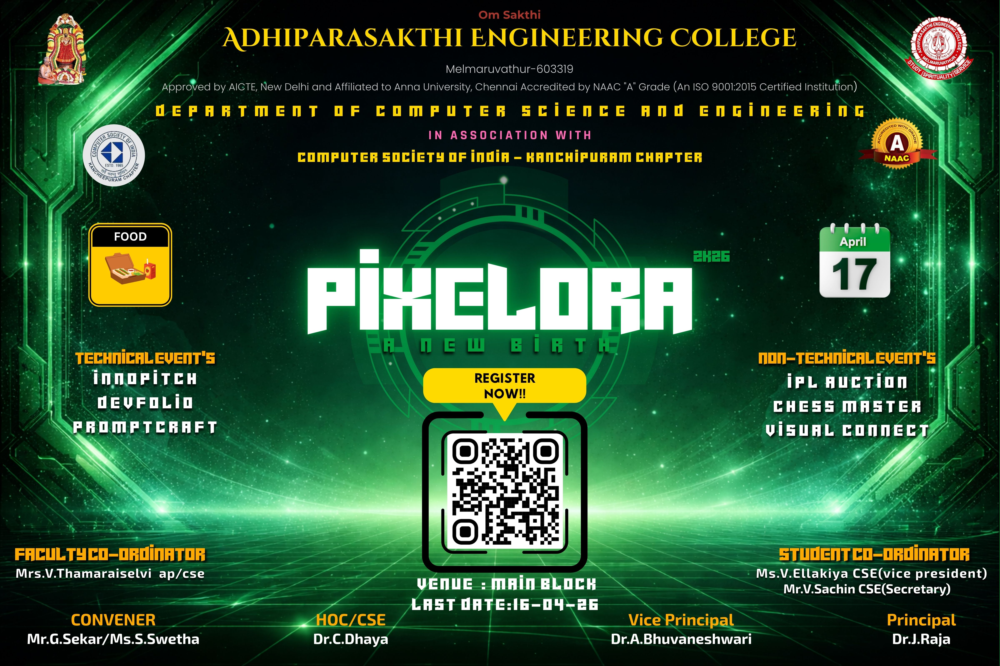

# 🚀 PIXELORA 2K26 | CSE Symposium Website

PIXELORA 2K26 is a premium, high-performance event landing page for the National Level Technical Symposium organized by the **Department of Computer Science and Engineering** at **Adhiparasakthi Engineering College (APEC)**.



## ✨ Features

* **Modern UI/UX:** A futuristic dark-themed interface with a neon green accent (`#00ff88`).
* **Smooth Experience:** Integrated with **Lenis** for buttery smooth scrolling and **Vanilla Tilt** for 3D card interactions.
* **Dynamic Countdown:** Real-time countdown timer ticking down to the event registration deadline.
* **Responsive Design:** Fully optimized for mobile, tablet, and desktop screens.
* **Ambient Visuals:** Features floating glassmorphism orbs, a custom spotlight cursor glow, and scroll-reveal animations.
* **Direct Interaction:** WhatsApp and Call integration for student coordinators.

## 🛠️ Tech Stack

* **Frontend:** HTML5, CSS3 (Modern Flex/Grid, Custom Properties)
* **Fonts:** Outfit & Inter (via Google Fonts)
* **Icons:** Phosphor Icons
* **Libraries:** * [Lenis](https://github.com/darkroomengineering/lenis) - Smooth Scroll
    * [Vanilla-Tilt.js](https://micku7zu.github.io/vanilla-tilt.js/) - 3D Hover Effects

## 📅 Event Details

* **Date:** April 17, 2026
* **Venue:** Main Block Auditorium, APEC
* **Entry Fee:** ₹150 / Head
* **Registration Deadline:** April 16, 2026

### Technical Events
1. **Innopitch** (Idea pitching)
2. **DevFolio** (On-spot coding/portfolio dev)
3. **PromptCraft** (AI image generation)

### Non-Technical Events
1. **IPL Auction**
2. **Chess Master**
3. **Visual Connect**

## 🚀 How to Run Locally

1.  **Clone the repository:**
    ```bash
    git clone [https://github.com/your-username/pixelora-2k26.git](https://github.com/your-username/pixelora-2k26.git)
    ```
2.  **Navigate to the folder:**
    ```bash
    cd pixelora-2k26
    ```
3.  **Open `index.html`** in your favorite browser.

## 👨‍💻 Credits

* **Lead Developer:** Sachin V
* **Organization:** Department of CSE, Adhiparasakthi Engineering College.

---
© 2026 PIXELORA. All Rights Reserved.
